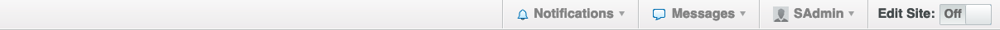
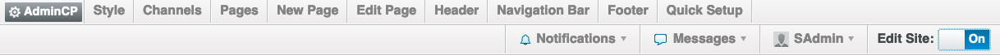

Site Builder allows you to build the community that you want. As the site administrator, you can edit existing pages and create new ones.  This is done using a drag and drop interface so you can see your work as you build. All without logging in to the **AdminCP**. **Site Builder** deals with the outward facing portion of a site, the **AdminCP** controls the nuts and bolts of the system.

> Background: vBulletin Publishing Suite had limited capabilities to do this with CMS pages, Forum Blocks, and the Ad Manager. vBulletin improves on those capabilities and applies them to every page of your site.

To see a list of available modules that you can use on your pages see the [Module List](/site_builder/pages/add_modules).

Everything else is controlled and administered using the [AdminCP](/admin_control_panel).

## Accessing Site Builder
If you’re an Administrator in vBulletin 5, you might have noticed a new button to the right of your login. This button lets you access the Site Builder. The Site Builder lets you create new pages, and add and remove modules to existing pages. It also allows you to edit the header, the footer and the navigation bar.  

The first step in customizing pages on your site is to turn Site Builder on. To do that, just click the Edit Site toggle. Once turned on, Site Builder will stay on until you turn it off. This will reveal a new menu items at the top of the page, like this:

The new items are the commands for Site Builder. These are: Channels, Style, Pages, New Page, Edit Page, Header, Navigation Bar, and Footer. Each option controls and edits a different part of your site. Clicking on any link will reveal the related tools without reloading the page.

